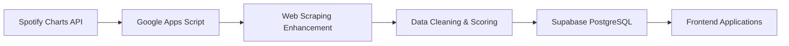

# 🎵 Spotify Podcast Charts Sync Engine

> **An elegant, cost-free data synchronization system that perpetually tracks Spotify podcast rankings across multiple regions using Google Apps Script, Supabase, and smart web scraping.**

  

## 🏗️ **The Elegant Architecture**

This system demonstrates a sophisticated **3-tier serverless architecture** that operates indefinitely within free cloud service tiers:

**🤖 Google Apps Script** → Scheduled execution engine (runs every 24 hours)  
**🗄️ Supabase PostgreSQL** → Managed database with REST API  
**🌐 Frontend Ready** → Any web app can consume the data via Supabase API  

### The Key Advantage

Unlike traditional server-based approaches requiring monthly hosting fees, this system **runs perpetually for free** while maintaining enterprise-grade reliability. The scheduled sync keeps your Supabase database active (preventing auto-deletion), while the serverless model eliminates infrastructure management entirely.

## 📊 **Data Collection & Scoring**

### **Multi-Region Tracking**
- 🇸🇪 **Sweden** - `podcastcharts.byspotify.com/api/charts/top_episodes?region=se`
- 🇺🇸 **United States** - `podcastcharts.byspotify.com/api/charts/top_episodes?region=us`

### **Smart Scoring System**
Episodes receive performance scores based on chart position:

```javascript
score = 250 - rank_position + 1
```

- **Rank #1** → 250 points
- **Rank #2** → 249 points  
- **Rank #250** → 1 point

This creates consistent performance metrics for historical trend analysis across different time periods.

### **Enhanced Metadata**
For each episode, the system intelligently scrapes Spotify web pages to extract:
- Full episode descriptions
- Episode duration
- Show metadata
- Cleaned Unicode text (database-safe)

## 🚀 **Quick Setup**

### **1. Configure Supabase**
```javascript
const SUPABASE_URL = 'https://your-project.supabase.co';
const SUPABASE_SERVICE_KEY = 'your_service_role_key_here';
```

### **2. Deploy to Google Apps Script**
1. Copy `tracker.js` to [script.google.com](https://script.google.com)
2. Update the Supabase configuration
3. Set up daily trigger in Apps Script dashboard

### **3. Database Setup**
Create the required RPC function in your Supabase database:
```sql
-- Your upsert_episode_score function here
```

## 🔧 **Key Functions**

| Function | Purpose |
|----------|---------|
| `dailyPodcastSync()` | Main sync function (both regions, 250 episodes each) |
| `testPodcastSync()` | Test with 15 episodes per region |
| `syncRegionDirectly()` | Core sync logic for specific region |
| `extractSpotifyEpisodeInfo()` | Web scraping for enhanced metadata |
| `upsertEpisodeToSupabase()` | Database operations via RPC |

## 📈 **Data Pipeline**



**Daily Process:**
1. **Fetch** → Get top episodes from Spotify charts
2. **Enhance** → Scrape additional metadata from episode pages
3. **Score** → Apply performance-based ranking system
4. **Store** → Upsert to Supabase with Unicode cleaning
5. **Serve** → Data available via REST API for frontends

## 🛡️ **Reliability Features**

- **Rate Limiting** → 50ms delays between requests, 100ms every 10 episodes
- **Retry Logic** → Automatic retry for 403 errors with exponential backoff  
- **Error Handling** → Comprehensive logging and graceful failure recovery
- **Unicode Cleaning** → Database-safe text processing for international content
- **Health Monitoring** → Detailed sync reports and success metrics

## 🎯 **Perfect For**

- **Podcast Analytics Dashboards** → Real-time ranking data
- **Market Research** → Cross-region performance comparison  
- **Trend Analysis** → Historical episode performance tracking
- **Content Discovery** → Top-performing episode identification

## 🔮 **Extensible Design**

The modular architecture supports easy extension:
- **Additional Regions** → Simply add new chart URLs
- **More Platforms** → Adapt scraping logic for other services
- **Custom Scoring** → Modify the ranking algorithm
- **Enhanced Metadata** → Extract additional episode details

---

**Built with ❤️ for sustainable, cost-effective data systems**

*A demonstration of how modern cloud services can be orchestrated to create sophisticated data pipelines without ongoing infrastructure costs.* 